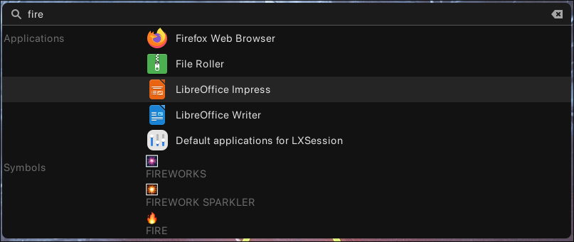
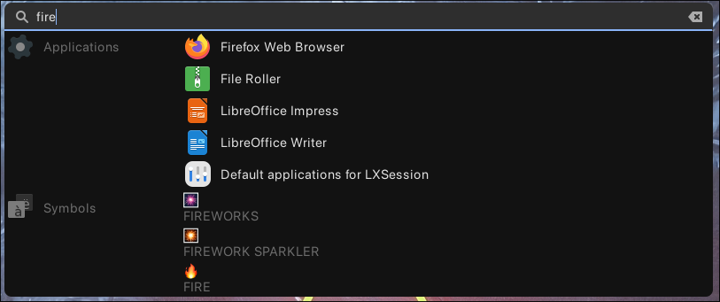

# Anyrun

A wayland native krunner-like runner, made with customizability in mind.

---

*This repo was forked to have some more fresh dependencies and plugins, small and big fixes/refactors, etc*

check out [fork comments](#fork-comments)

# Features

- Style customizability with GTK+ CSS
  - More info in [Styling](#Styling)
- Can do basically anything
  - As long as it can work with input and selection
  - Hence the name anyrun
- Easy to make plugins
  - You only need 4 functions!
  - See [Rink](plugins/rink) for a simple example. More info in the
    documentation of the [anyrun-plugin](anyrun-plugin) crate.
- Responsive
  - Asynchronous running of plugin functions
- Wayland native
  - GTK layer shell for overlaying the window
  - data-control for managing the clipboard

# Screenshots




# Usage

## Dependencies

Anyrun mainly depends various GTK libraries, and rust of course for building the
project. Rust you can get with [rustup](https://rustup.rs). The rest are
statically linked in the binary. Here are the libraries you need to have to
build & run it:

- `gtk4-layer-shell (libgtk4-layer-shell.so)`
- `gtk4 (libgtk-4.so)`
- `pango (libpango-1.0)`
- `cairo (libcairo libcairo-gobject)`
- `gdk-pixbuf2 (libgdk_pixbuf-2.0)`
- `glib2 (libgobject-2.0 libgio-2.0 libglib-2.0)`

> [!NOTE]
> `gdk-pixbuf2 (libgdk_pixbuf-2.0)` maybe don't need

## Installation

> [!NOTE]
>
> As long as this is fork and I'm writing it mostly for myself
> 
> it's not packaged at all (packaging stats here is about original project)
> 
> If you really want to use this fork so better [build it](#manual-installation)

[](https://repology.org/project/anyrun/versions)

### Nix

See [Nix.md](docs/Nix.md)

### Manual installation

Make sure all of the dependencies are installed, and then run the following
commands in order:

```sh
git clone --recursive https://github.com/bzglve/anyrun.git # Clone the repository
cd anyrun # Change the active directory to it
cargo build --release # Build all the packages
cargo install --path anyrun/ # Install the anyrun binary
mkdir -p ~/.config/anyrun/plugins # Create the config directory and the plugins subdirectory
cp target/release/*.so ~/.config/anyrun/plugins # Copy all of the built plugins to the correct directory
cp examples/config.ron ~/.config/anyrun/config.ron # Copy the default config file
```

## Plugins

Anyrun requires plugins to function, as they provide the results for input. The
list of plugins in this repository is as follows:

- [Applications](plugins/applications/README.md)
  - Search and run system & user specific desktop entries.
- [Symbols](plugins/symbols/README.md)
  - Search unicode symbols.
- [Rink](plugins/rink/README.md)
  - Calculator & unit conversion.
- [Shell](plugins/shell/README.md)
  - Run shell commands.
- [Translate](plugins/translate/README.md)
  - Quickly translate text.
- [Kidex](plugins/kidex/README.md)
  - File search provided by [Kidex](https://github.com/Kirottu/kidex).
- [Randr](plugins/randr/README.md)
  - Rotate and resize; quickly change monitor configurations on the fly.
  - TODO: Only supports Hyprland, needs support for other compositors.
- [Stdin](plugins/stdin/README.md)
  - Turn Anyrun into a dmenu like fuzzy selector.
  - Should generally be used exclusively with the `--plugins` argument.
- [Dictionary](plugins/dictionary/README.md)
  - Look up definitions for words
- [Websearch](plugins/websearch/README.md)
  - Search the web with configurable engines: Google, Ecosia, Bing, DuckDuckGo.

## Configuration

The default configuration directory is `$HOME/.config/anyrun` the structure of
the config directory is as follows and should be respected by plugins:

```text
- anyrun
  - plugins
    <plugin dynamic libraries>
  config.ron
  style.css
  <any plugin specific config files>
```

The [default config file](examples/config.ron) contains the default values, and
annotates all configuration options with comments on what they are and how to
use them.

## Styling

> [!NOTE]
>
> Currently with `ScrolledWindow` you can leave all styles empty/comment all out/remove file (will throw Gtk-WARNING but it's ok)/etc

> [!WARNING]
>
> May be changes, not tested

Anyrun supports [GTK+ CSS](https://docs.gtk.org/gtk4/css-overview.html) styling.
The names for the different widgets and widgets associated with them are as
follows:

- `entry`: The entry box
  - `GtkEntry`
- `window`: The window
  - `GtkWindow`
- `main`: "Main" parts of the layout
  - `GtkListBox`: The main list containing the plugins
  - `GtkBox`: The box combining the main list and the entry box
- `plugin`: Anything for the entire plugin
  - `GtkLabel`: The name of the plugin
  - `GtkBox`: The different boxes in the plugin view
  - `GtkImage`: The icon of the plugin
- `match`: Widgets of a specific match
  - `GtkBox`: The main box of the match and the box containing the title and the
    description if present
  - `GtkImage`: The icon of the match (if present)
- `match-title`: Specific for the title of the match
  - `GtkLabel`
- `match-desc`: Specific for the description of the match
  - `GtkLabel`

## Arguments

The custom arguments for anyrun are as follows:

- `--config-dir`, `-c`: Override the configuration directory

The rest of the arguments are automatically generated based on the config, and
can be used to override configuration parameters. For example if you want to
temporarily only run the Applications and Symbols plugins on the top side of the
screen, you would run
`anyrun --plugins libapplications.so --plugins libsymbols.so --position top`.

# Plugin development

See [Plugin_development.md](docs/Plugin_development.md)

# Fork comments

## Currently made

- plugins as git submodules
- updated `wl-clipboard` to `0.8.1` to fix copy-paste issues
- updated to latest version of `gtk4` with `gtk4-layer-shell`
  - Get rid of fulscreen window
  - Scrollable matches
- flat list instead of list of lists to use native navigation and activation handling (yes now it looks like Krunner)
  - On `Enter` key with entry focus activate first match (currently without selected match highlight)
- plugins
  - applications
    - replaced with [peppidesu's](https://github.com/peppidesu/plugin-applications.git) repo
  - kidex
    - added `prefix`
  - randr
    - updated to newer [hyprland crate](https://crates.io/crates/hyprland)
      
      it's currently unstable but it's working
  - translate
    - `tokio` with `rt-multi-thread` feature instead of `rt` because of `Runtime::new()`

## TODO

- [x] Seems like that somehing like `--plugins libstdin.so` don't work as expected
  - [ ] If anyrun launched in something like sigle-plugin mode then plugin can request to hide entry or something else... Maybe it can request changing window placement, or specify custom in it's own config (for power-menu or whatever)
- [x] Migrate to gtk4 due to [Support for gtk3-rs crates was dropped](https://gtk-rs.org/blog/2024/06/01/new-release.html)
  - [x] `Down` and `Up` keys should focus from entry to the list and back
  - [x] click to close (seems it will not work [comments](#todo-comments))
  - [x] Scroll window instead of using `max_entries` or plugin `max_entries` (now config field was removed (p.s. I can't do this do to laziness))
    - [x] Get rid of full screen window
      - [x] Anchors from config
      - [x] Margins from config (like there was `x` and `y` options)
        - [x] Use RealtiveNum instead
      - [ ] Option to place entry down if window is anchored to the bottom
    - [x] Dynamic window size on mathces update wrapping all in scroll if it's too big
  - [ ] Completion for entry
- [ ] Up key on open should insert previous search (If we use Up/Down keys for focus, then it can only save previous state)
  - [ ] Config option to save previous search on close and have it on open
  - [ ] Handle properly exclusive plugin
- [ ] help matches (maybe based on `#[info]` macro or adding some special `#[help]` macto)
  - [ ] `?` should return some common help or default usage for plugin
  - [ ] `? <plugin>` should return some plugin usage (maybe based on it's config)
- [x] Select first match by default as it is has default activate
- [ ] Add something like daemon mode to make launch faster. Instead of loading all libs and stuff every time we need just open/hide window using daemon
- [ ] `ci: Security audit` fails up because of `generational-arena` crate as it's unmaintaned. Need to move to something more alive

### TODO-comments

- click on close outside window seems to be impossible with wayland if not to fake by creating transparent fullscreen window. Hope it will be some kind reworked in future releases of Wayland+GTK. I hope I'm wrong about this and just couldn't find the correct information. (help is welcome)
